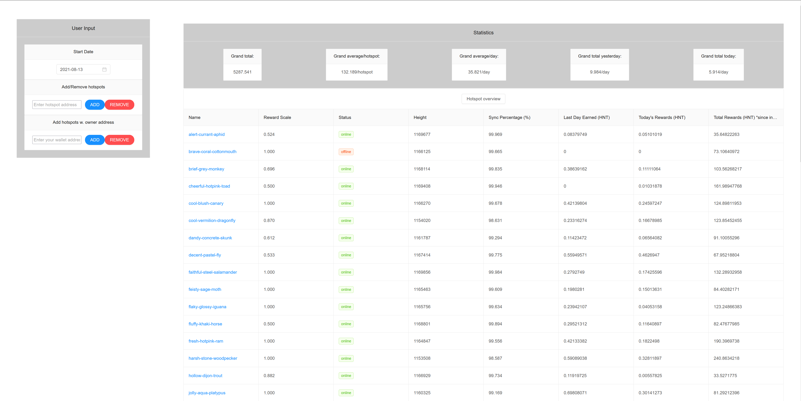

# Helium Hotspot Dashboard (V1)

A simple [Helium](https://www.helium.com/) hotspot dashboard made in [Vue](https://vuejs.org/) which allows to see how much [$HNT](https://coinmarketcap.com/currencies/helium/) a given set of hotspots have earned on a daily bases.

## V1

This first version of the dashboard serves as a mere experiment on my experience with the [Helium API](https://docs.helium.com/api/) and what data it exposes to its users.

### Example 1

_The first component gives an overal overview of each hotspot you've individually added or through a wallets address_

### Example 2

_The second component gives an overview of all daily earnings of all hotspots starting on the users input startdate and ending on the current date._

### Project setup

For this project you need [npmjs](https://www.npmjs.com/) to install all packages with `npm i` and [serve](https://www.npmjs.com/package/serve) with `npm i serve -g`.

After that run `npm run build` which produces a production build of the project in the newly created `dist`-folder.

The last step is to run the production build with `serve -s dist`.

## V2

The second version of the dashboard will focus on adding more functionality and making the user experience a lot better by making everything more intuitive.
